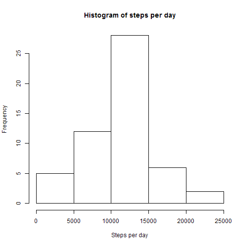
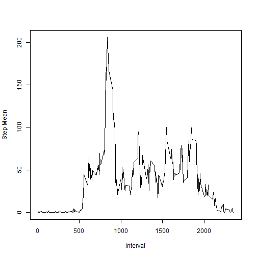
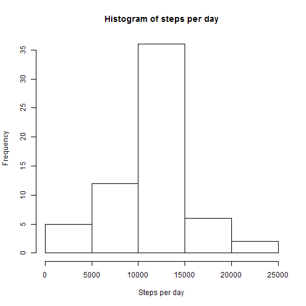
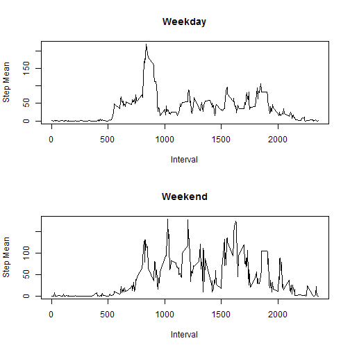

This is my version of the Reproducible Research Course Project 1.

###Step 1: Loading and preprocessing the data

1. Loading the data

```r
activity <- read.csv("activity.csv")
```

2. It's necessary to further transform/process the data

```r
activity$date <- as.Date(activity$date)
```

###Step 2: What is mean total number of steps taken per day?
1. Calculate the total number of steps taken per day

```r
library(dplyr)
activity <- group_by(activity, date)
steps_per_day <- summarise(activity, steps=sum(steps))
```

2. Make a histogram of the total number of steps taken each day


```r
hist(steps_per_day$steps, xlab="Steps per day", main="Histogram of steps per day")
```

 

3. Calculate and report the mean and median of the total number of steps taken per day

```r
steps_per_day_mean_median <- summarise(activity, mean=mean(steps, na.rm=T), median=median(steps, na.rm=T))
print(steps_per_day_mean_median)
```

```
## Source: local data frame [61 x 3]
## 
##          date     mean median
## 1  2012-10-01       NA     NA
## 2  2012-10-02  0.43750      0
## 3  2012-10-03 39.41667      0
## 4  2012-10-04 42.06944      0
## 5  2012-10-05 46.15972      0
## 6  2012-10-06 53.54167      0
## 7  2012-10-07 38.24653      0
## 8  2012-10-08      NaN     NA
## 9  2012-10-09 44.48264      0
## 10 2012-10-10 34.37500      0
## ..        ...      ...    ...
```

###Step 3: What is the average daily activity pattern?
1. Make a time series plot (i.e. type = "l") of the 5-minute interval (x-axis) and the average number of steps taken, averaged across all days (y-axis)


```r
activity <- ungroup(activity)
activity <- group_by(activity, interval)
interval_step_mean <- summarise(activity, mean=mean(steps, na.rm=TRUE))
plot(interval_step_mean$interval, interval_step_mean$mean, "l", xlab="Interval", ylab="Step Mean")
```

 

2. Which 5-minute interval, on average across all the days in the dataset, contains the maximum number of steps?

```r
filter(interval_step_mean, mean==max(mean))
```

```
## Source: local data frame [1 x 2]
## 
##   interval     mean
## 1      835 206.1698
```

The answer is the 835 interval (08:35, in hh:mm)

###Step 4: Imputing missing values
1. Calculate and report the total number of missing values in the dataset

```r
na_activity <- ungroup(activity)
sum(is.na(na_activity$steps))
```

```
## [1] 2304
```

2. Devise a strategy for filling in all of the missing values in the dataset

```r
na_activity$steps[is.na(na_activity$steps)] <- ave(na_activity$steps,na_activity$interval,FUN=function(x)mean(x,na.rm = T))[is.na(na_activity$steps)]
```

Method from Henrique Dallazuanna, extracted from [here](http://grokbase.com/t/r/r-help/0969yezzan/r-how-to-substitute-missing-values-nas-by-the-group-means)

3.Create a new dataset that is equal to the original dataset but with the missing data filled in.
Already done in the previous paragraph!

4. Make a histogram of the total number of steps taken each day and Calculate and report the mean and median total number of steps taken per day

```r
na_activity <- group_by(na_activity, date)
na_steps_per_day <- summarise(na_activity, steps=sum(steps))
hist(na_steps_per_day$steps, xlab="Steps per day", main="Histogram of steps per day")
```

 

```r
na_activity_day <- group_by(na_activity, date)
na_activity_steps_per_day_mean_median <- summarise(na_activity_day, mean=mean(steps), median=median(steps))
print(na_activity_steps_per_day_mean_median)
```

```
## Source: local data frame [61 x 3]
## 
##          date     mean   median
## 1  2012-10-01 37.38260 34.11321
## 2  2012-10-02  0.43750  0.00000
## 3  2012-10-03 39.41667  0.00000
## 4  2012-10-04 42.06944  0.00000
## 5  2012-10-05 46.15972  0.00000
## 6  2012-10-06 53.54167  0.00000
## 7  2012-10-07 38.24653  0.00000
## 8  2012-10-08 37.38260 34.11321
## 9  2012-10-09 44.48264  0.00000
## 10 2012-10-10 34.37500  0.00000
## ..        ...      ...      ...
```

Do these values differ from the estimates from the first part of the assignment? **Yes, they do.** What is the impact of imputing missing data on the estimates of the total daily number of steps? **The frequency of mid-values (10000-15000 steps per day) rises**

###Step 5: Are there differences in activity patterns between weekdays and weekends?
1. Create a new factor variable in the dataset with two levels (weekday and weekend) indicating whether a given date is a weekday or weekend day.

```r
weekend <- ifelse(weekdays(na_activity$date)=="s??bado", 1,0)
weekend <- ifelse(weekdays(na_activity$date)=="domingo", 1,weekend)
na_activity$f <- weekend
na_activity$f <- as.factor(na_activity$f)
levels(na_activity$f) <- c("weekday", "weekend")
```

2. Make a panel plot containing a time series plot (i.e. type = "l") of the 5-minute interval (x-axis) and the average number of steps taken, averaged across all weekday days or weekend days (y-axis)

```r
library(ggplot2)
na_activity <- ungroup(na_activity)
na_activity_split <- split(na_activity, na_activity$f)
wd<-as.data.frame(na_activity_split[1])
we<-as.data.frame(na_activity_split[2])
wd <- group_by(wd, weekday.interval)
we <- group_by(we, weekend.interval)
wd_s <- summarise(wd, mean=mean(weekday.steps))
we_s <- summarise(we, mean=mean(weekend.steps))
par(mfrow=c(2,1))
plot(wd_s$weekday.interval, wd_s$mean, "l", xlab="Interval", ylab="Step Mean", main="Weekday")
plot(we_s$weekend.interval, we_s$mean, "l", xlab="Interval", ylab="Step Mean", main="Weekend")
```

 

